# Agy-Context-Saver 🛡️

**Deterministic Lifecycle Guard and Context-Isolation Governor for Google Antigravity Agents**

`Agy-Context-Saver` is a lightweight, zero-dependency plugin and lifecycle governor for Google Antigravity. It eliminates session degradation, memory leaks, and chat stalls caused by **background task busy-wait polling** and **compaction lag**.

---

## The Problem: The Antigravity Polling Trap

When an Antigravity agent runs a shell command that takes longer than `WaitMsBeforeAsync` (default ~5s), the platform detaches the process into a background task. 

Left unconstrained, LLMs exhibit a compulsive **busy-waiting anti-pattern**:
1. The agent calls `manage_task(Action='status')` or schedules 30s timers with `schedule(...)` in an infinite loop.
2. Every `status` call pulls the entire task stdout log (hundreds of ASCII dots / ANSI sequences) directly into the conversation transcript.
3. Because background context compaction triggers infrequently, the transcript expands by hundreds of kilobytes in minutes.
4. The context window degrades, critical prompt instructions drift out of attention, and the session eventually crashes or becomes unresponsive.

---

## The Solution: 3-Layer Architecture

```mermaid
flowchart TD
    subgraph Layer 1: Machine-Enforced Polling Ban
        A["Agent calls manage_task('status')"] --> B["PreToolUse Hook intercepts"]
        B -->|Status Poll Detected| C["Return decision: 'deny'<br/>'Polling denied. Yield turn and wait for Reactive Wakeup.'"]
        
        D["Agent calls schedule(polling timer)"] --> E["PreToolUse Hook intercepts"]
        E -->|Polling Intent Detected| F["Return decision: 'deny'<br/>'Artificial polling timer denied.'"]
    end

    subgraph Layer 2: Fast Synchronous Execution
        G["Agent calls run_command"] --> H["PreToolUse Hook intercepts"]
        H -->|WaitMsBeforeAsync < 10000| I["Apply overwrite:<br/>WaitMsBeforeAsync = 10000"]
    end

    subgraph Layer 3: Context Offloading via Subagents
        J["Agent needs broad context / exploration"] --> K["Delegate to Subagents (invoke_subagent)"]
        K --> L["Subagent explores in isolated context"]
        L --> M["Returns concise 1-paragraph summary to Main Thread"]
    end
```



### Layer 1: Machine-Enforced Polling Ban (`PreToolUse` Hook)
* **Hard Block on `manage_task(status)`**: Physically denies busy-wait status checks before execution.
* **Enforced Reactive Wakeup**: Forces the agent to stop calling tools and yield the turn. When the background command finishes, Antigravity's native `<SYSTEM_MESSAGE>` wakeup notification automatically resumes the session.
* **Blocks Artificial Sleep Timers**: Rejects `schedule` calls intended to loop on background tasks.

### Layer 2: Fast Synchronous Execution Maximization (`PreToolUse` Overwrite)
* Uses Antigravity's native hook `overwrite` capability to automatically force `WaitMsBeforeAsync: 10000` (the platform maximum) on non-daemon commands.
* Fast tests (<10s) complete synchronously in the same turn without spawning background tasks.

### Layer 3: Subagent Context Offloading & Minimalist Footprint (Agent Rule)
* Codifies that all deep context gathering (grepping logs, reading dozens of files, investigating transcripts) MUST be delegated to subagents (`invoke_subagent`).
* Subagents execute in isolated transcript sandboxes; only synthesized findings return to the main thread.
* The main conversation remains pristine and free of context-bloat.

---

## Installation

### Method 1: Automatic Installer (PowerShell)
Clone the repository and run the installer:
```powershell
git clone https://github.com/paragon-ux/Agy-Context-Saver.git
cd Agy-Context-Saver
.\install.ps1
```

### Method 2: Manual Registration in `hooks.json`
Add the hook definition to your `~/.gemini/config/hooks.json`:
```json
{
  "execution-guard": {
    "PreToolUse": [
      {
        "matcher": "manage_task|run_command|schedule",
        "hooks": [
          {
            "type": "command",
            "command": "node scripts/execution-guard-hook.mjs",
            "timeout": 5
          }
        ]
      }
    ]
  }
}
```

### Method 3: Antigravity Plugin Mode
Copy the repository into your global plugins directory:
```powershell
Copy-Item -Path . -Destination "$env:USERPROFILE\.gemini\config\plugins\agy-context-saver" -Recurse
```

---

## Verification & Testing

Run the included automated test suite:
```bash
npm test
```

Test output verifies all 6 governance paths:
```
Running Agy-Context-Saver hook tests...

✓ manage_task(status) is denied
✓ manage_task(kill) is allowed
✓ run_command upgrades WaitMsBeforeAsync to 10000
✓ run_command with IsDaemon: true preserves wait window
✓ schedule with task polling prompt is denied
✓ schedule standard timer is allowed

All 6 tests passed successfully!
```

---

## License
MIT License. Created by paragon-ux.
