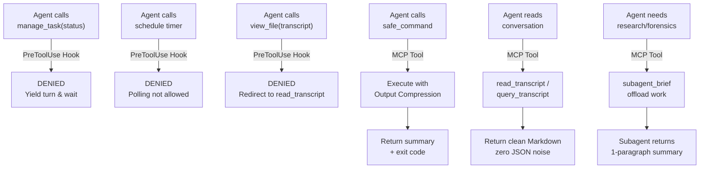

# Agy-Context-Saver 🛡️

**Cross-Platform Model Context Protocol (MCP) Server & Lifecycle Governor for Google Antigravity**

`Agy-Context-Saver` is a lightweight, zero-dependency MCP server and lifecycle governor purpose-built for **Google Antigravity** (`agy`). It eliminates session degradation, memory bloat, and context window exhaustion caused by two independent failure modes: **background task busy-wait polling** and **raw transcript reading**.

Because Google restricts third-party submissions to the Antigravity plugin marketplace, `Agy-Context-Saver` uses the **open Model Context Protocol (MCP)** standard so that any Antigravity user on macOS, Linux, or Windows can install and run it immediately via `mcp_config.json`.

---

## The Problems: Two Independent Context Traps

Without governance, Antigravity sessions suffer from two distinct failure modes that corrupt context attention and degrade long-running sessions:

### Problem 1: The Background Task Polling Trap (Runaway Busy-Waiting)
When an agent runs a shell command that takes longer than `WaitMsBeforeAsync` (default ~5s), Antigravity detaches the process to a background task (`task-XYZ`).
* **The Anti-Pattern**: Models exhibit a compulsive busy-waiting loop, calling `manage_task(Action='status')` or scheduling short timers (`schedule(...)`) repeatedly instead of yielding execution for native reactive notifications.
* **The Log Explosion**: Every `status` poll dumps the full task stdout buffer (hundreds of lines of raw ASCII progress dots, ANSI escape sequences, repetitive build logs) directly into the conversation transcript.
* **The Impact**: Because background context compaction fires infrequently, the transcript inflates by 50–100 KB per minute. Working memory degrades, critical prompt instructions get pushed out of attention, and the session slows down or stalls.

### Problem 2: The Raw Transcript Reading Trap (JSON Bloat & Compaction Amnesia)
When an agent needs to review historical turns, inspect a subagent's findings, or resume previous work, Antigravity's system instructions advise agents to read `transcript.jsonl` directly.
* **The Raw JSON Tax**: Models naturally call native `view_file` on multi-megabyte `transcript.jsonl` files, dumping raw JSON structures, escaped strings (`\"`, `\n`), internal timestamps, and massive tool call arguments into the active context window.
* **The Dual-File Chore**: Because `transcript.jsonl` truncates large fields, the model must manually cross-reference and parse corresponding line numbers in `transcript_full.jsonl`, introducing further cognitive overhead and token waste.
* **Post-Compaction Amnesia**: When context compaction occurs, the agent's short-term conversational context is compressed, and the model reverts to its baseline system prompt habits. It immediately attempts another `view_file` read on `transcript.jsonl`, re-polluting the newly compacted window with thousands of tokens of raw JSON overhead.

---

## Architecture: 3-Layer Context Defense



### Layer 1: Intelligent Polling Governor & Reactive Wakeup
* **Blocks Runaway Busy-Waiting**: Blocks rapid repetitive `manage_task(Action='status')` polling loops and short artificial timers (<120s) that bloat transcripts.
* **Transcript Read Enforcement**: Intercepts naive `view_file` calls targeting `transcript.jsonl` or `transcript_full.jsonl`, denying them and redirecting the model to use `read_transcript` or `query_transcript`, permanently stopping post-compaction context bloat.
* **Safe Harbor for Stuck Task Debugging**: Allows status inspections for diagnostic troubleshooting if a process might not exit properly (deadlock, hung build). Initial check and spaced-out cooldown checks (>=30s) are permitted so agents can inspect logs and kill frozen processes.
* **Safe Harbor for `/teamwork-preview` & Subagents**: Multi-agent coordination and subagent tasks are never blocked from monitoring.
* **Watchdog Timers**: Legitimate watchdog timers on `schedule` (>= 120s) to catch unhandled stalls are fully permitted.
* **3-Tier Circuit Breaker**: If an agent model stubbornly attempts repeated denied polling calls in succession without yielding, the governor automatically escalates: Tier 1 (standard guidance) $\to$ Tier 2 (critical warning) $\to$ Tier 3 (`force_ask`), immediately freezing autonomous execution to prompt the user and halt runaway trajectory corruption.

### Layer 2: Fast Synchronous Execution & Output Compression
* **MCP `safe_command`**: Runs shell commands with generous timeouts and **intelligent output compression** (collapses repetitive test dots/logs into concise summaries), preventing raw log explosions from ever reaching the transcript.
* **Native Hook Overwrite**: Automatically forces `WaitMsBeforeAsync: 10000` on native Antigravity commands so fast commands (<10s) complete synchronously in the same turn without spawning background tasks.

### Layer 3: Subagent Context Offloading
* **MCP `subagent_brief`**: Generates scope-isolated prompts for delegated subagents (`invoke_subagent`).
* Subagents absorb heavy exploration (grepping, viewing multiple large files, inspecting raw transcripts) in their own sandboxed transcripts, returning only a high-signal briefing to the main thread.

---

---

## Zero-Delay Instant Installation ⚡

`Agy-Context-Saver` can be installed in milliseconds without manual configuration file editing:

### Option 1: One-Line CLI / NPX (Fastest)

```bash
# If using npx
npx agy-context-saver install

# Or locally inside the repository
npm run setup
```
*(Executes in ~15ms: automatically links the native Antigravity plugin and mirrors tool definitions).*

### Option 2: Native Antigravity Plugin Link (Zero Overhead)

Because `Agy-Context-Saver` is a fully structured Antigravity Plugin, you can link it directly into your Antigravity plugins directory:

**Windows (cmd / PowerShell):**
```powershell
.\install.ps1
# Or manual junction:
cmd /c mklink /J "$env:USERPROFILE\.gemini\config\plugins\agy-context-saver" "$PWD"
```

**macOS / Linux:**
```bash
./install.sh
# Or manual symlink:
ln -s "$(pwd)" ~/.gemini/config/plugins/agy-context-saver
```

### Option 3: Manual MCP Config (Optional)

If you prefer explicit MCP server registration in `~/.gemini/config/mcp_config.json`:

```json
{
  "mcpServers": {
    "agy-context-saver": {
      "command": "node",
      "args": ["C:/Users/USER/Desktop/Frameworks/Agy-Context-Saver/mcp/index.js"]
    }
  }
}
```

### Option 3: Universal MCP Server & Native In-Chat Tools

Once installed, 7 native MCP tools are directly available to your Antigravity agent or can be called from chat:

1. **`safe_command`**: Runs shell commands with intelligent log compression, streaming buffer concatenation, 2,000-char line clamping, and escalating SIGKILL timeout protection.
2. **`check_context_health`**: Streams `transcript.jsonl` using chunked `readline` to audit turn budgets, total payload sizes, and busy-polling events without memory spikes.
3. **`read_transcript`**: Reads recent conversation turns from Antigravity transcripts in clean Markdown with zero raw JSON noise. Supports `"compact"` and `"full"` modes with 1-to-2 parameters.
4. **`query_transcript`**: Forensic query and filtering engine. Searches by keyword or regex, filters by role (`user`, `assistant`, `tool`, `error`), and automatically dereferences truncated lines from `transcript_full.jsonl`.
5. **`subagent_brief`**: Formulates scope-isolated prompts for delegated subagents to offload context-heavy exploration.
6. **`get_installation_status`**: Audits the live 4-layer health (Plugin Link, Lifecycle Hook, MCP Server, Tool Schemas) from inside Antigravity or CLI.
7. **`sync_installation`**: Programmatically synchronizes and repairs the installation in ~25ms without terminal commands.

Check installation health from CLI at any time:
```bash
npm run status
# or
node mcp/index.js status
```

---

## Performance Optimizations & Resilience Engine

- **Streaming Transcript Engine**: Reads transcripts using `readline` chunk streams, processing 100,000+ steps with bounded memory.
- **Array Buffer Aggregation**: Replaces O(n²) string concatenation with `Buffer.concat()`, eliminating event loop latency on high-volume stdout.
- **Pathological Clamping**: Restricts single output lines to 2,000 characters and total output to 64 KB, preventing terminal stream lockups.
- **Process Tree Escalation**: Dispatches `SIGTERM`, followed by a 1.5s grace period before escalating to `SIGKILL` / Windows `taskkill /T /F` to eliminate zombie processes.
- **TTL State Cache & Atomic Writes**: Automatically evicts hook polling cache entries older than 1 hour, capping state memory and writing via atomic tempfiles.
- **3-Tier Circuit Breaker**: Repeated polling denials escalate from Tier 1 (guidance) $\to$ Tier 2 (critical warning) $\to$ Tier 3 (`force_ask`), immediately freezing autonomous execution to prompt the user and halt runaway trajectory corruption.

---

## Transparency, Safety & Governance 🛡️

### Independent Community Tool & Compatibility Notice
`Agy-Context-Saver` is an open-source community extension purpose-built for Google Antigravity. It is **not developed, maintained, or officially endorsed by Google**.

The tool operates strictly within Antigravity's first-class extensibility specifications (`plugin.json`, `hooks.json`, `mcp_config.json`, and Model Context Protocol stdio servers) as documented in Antigravity's custom plugin guides. It has been tested and validated on Antigravity 2.0+ across Windows, macOS, and Linux.

### Exact Files & Locations Touched
To maintain total transparency, the following table lists every file and directory modified by `Agy-Context-Saver`:

| Filesystem Path | Purpose | Modification Behavior |
|:---|:---|:---|
| `~/.gemini/config/plugins/agy-context-saver` | Native Plugin Link | Directory junction (Windows) or symlink (Unix) linking repo to Antigravity plugin loader. |
| `~/.gemini/config/scripts/execution-guard-hook.mjs` | Local Hook Script | Mirrored hook script executed by Antigravity during `PreToolUse` lifecycle events. |
| `~/.gemini/config/hooks.json` | Lifecycle Hook Registration | Registers `execution-guard` for `manage_task\|run_command\|schedule\|view_file`. **Automatically creates `hooks.json.bak` backup before writing. Preserves all other hooks.** |
| `~/.gemini/config/mcp_config.json` | Universal MCP Server | Registers `agy-context-saver` under `mcpServers`. **Automatically creates `mcp_config.json.bak` backup before writing. Preserves all other servers.** |
| `~/.gemini/antigravity/mcp/agy-context-saver/` | Antigravity Tool Schemas | Mirrors the 7 tool JSON schemas and `instructions.md` for zero-delay discovery. |

### Safety & Defense-in-Depth Guarantees
1. **Pre-flight Write Probes**: Validates directory permissions prior to modifying any configuration files; fails early with clear errors if write access is denied.
2. **Automated Configuration Backups**: Automatically creates `.bak` backups (`hooks.json.bak`, `mcp_config.json.bak`) prior to modifying Antigravity configurations.
3. **Non-Destructive Merging**: Safely preserves foreign hooks (e.g., `waymark-continuity`) and third-party MCP servers (e.g., `waymark-engine`).
4. **Complete Rollback & Clean Uninstallation**: `npm run uninstall` cleanly unlinks plugins, removes mirrored scripts and schemas, and strips entries without touching other settings. Run `npm run uninstall -- --restore-backups` to immediately revert configuration files to `.bak` copies.
5. **Fail-Open Execution Invariant**: Hooks execute in <5ms. In the event of an unhandled runtime exception, missing file, or malformed stdin, the governor immediately fails open (`decision: "allow"`), ensuring the agent never hangs or crashes.
6. **Zero External Runtime Dependencies**: 100% native Node.js standard library (`fs`, `path`, `os`, `readline`, `child_process`). Zero npm supply-chain risk.

---

## Verification & Automated Tests

Run the complete test suite across all 5 verification layers:
```bash
npm test
```

Verification suite results:
```
Running Agy-Context-Saver intelligent hook tests...
✓ manage_task(status) initial check is allowed (safe harbor for debugging)
✓ manage_task(status) rapid consecutive poll is denied (busy-loop blocked)
✓ manage_task(status) with debugging context is allowed
✓ manage_task(status) with teamwork context is allowed
✓ manage_task(kill) is allowed
✓ run_command upgrades WaitMsBeforeAsync to 10000
✓ run_command with IsDaemon: true preserves wait window
✓ schedule short polling timer (<120s) is denied
✓ schedule watchdog timer (>=120s) is allowed
✓ schedule with teamwork context is allowed
✓ schedule standard timer is allowed
✓ state TTL eviction automatically purges entries older than 1 hour
✓ manage_task 3-tier circuit breaker correctly escalates Tier 1 -> Tier 2 -> Tier 3 (force_ask)
✓ schedule short polling timer escalates to force_ask on 5th denial
✓ manage_task(Action='list') initial call allowed, rapid consecutive polling blocked
✓ view_file on standard source file is allowed (<1ms fast-path)
✓ view_file on transcript.jsonl is denied and redirects to read_transcript with extracted conversationId
✓ view_file on transcript_full.jsonl is denied and redirects to read_transcript
All 18 intelligent hook tests passed successfully!

Running Agy-Context-Saver MCP Server tests...
✓ initialize handshake succeeded
✓ tools/list returned all 7 governance & transcript tools
✓ tools/call (safe_command) executed and captured stdout
✓ tools/call (subagent_brief) generated scope-isolated brief
✓ tools/call (get_installation_status) reported live 4-layer health
✓ tools/call (sync_installation) verified dry-run synchronization
✓ tools/call (read_transcript) successfully streamed and formatted conversation turns
✓ tools/call (query_transcript) filtered and returned matching forensic steps
✓ resources/read served governance rulebook
✓ prompts/get served context_shield prompt
All MCP tests passed successfully!

=================================================
Agy-Context-Saver Comprehensive End-to-End Probes
=================================================
--- Section 1: Hook Resilience Probes (Fail-Open Verification) ---
✓ Empty stdin -> decision: 'allow'
✓ Whitespace-only stdin -> decision: 'allow'
✓ Malformed JSON -> decision: 'allow'
✓ Non-JSON text payload -> decision: 'allow'
✓ Non-target tool calls (view_file, write_to_file, ask_question, replace_file_content, custom) -> decision: 'allow'
✓ Empty object / empty toolCall -> decision: 'allow'

--- Section 2: MCP Server Functional & End-to-End Probes ---
✓ MCP Server initialized
✓ safe_command successfully compressed 180 lines to 30 lines (top 15 + bottom 15 preserved, 150 compressed)
✓ Exit code 0 status preserved: [STATUS: PASSED (exit 0)]
✓ safe_command non-zero exit status (exit 42) accurately retained without data loss
✓ check_context_health accurately identified busy-polling loop and computed correct step & byte metrics
✓ subagent_brief generated strictly formatted, scope-isolated instructions
✓ safe_command successfully clamped pathological 5,000-char single line
✓ check_context_health streamed and parsed transcript with corrupt line tolerance
✓ safe_command terminated long-running command on timeout with escalating signal protection
✓ read_transcript successfully rendered clean Markdown dialogue in both compact and full modes
✓ read_transcript handled unclosed trailing flush and clamped binary/base64 media without errors
✓ query_transcript filtered steps by keyword and role with zero context bloat
✓ query_transcript auto-dereferenced truncated step from transcript_full.jsonl with step_index verification
ALL END-TO-END VERIFICATION PROBES PASSED 100%!

=================================================
Agy-Context-Saver Live Installed System Validation
=================================================
--- 1. Configuration Registration Verification ---
✓ hooks.json contains execution-guard and preserved waymark-continuity
✓ hooks.json.bak configuration backup verified
✓ mcp_config.json contains agy-context-saver and preserved waymark-engine
✓ mcp_config.json.bak configuration backup verified
✓ All 7 Antigravity tool schemas successfully installed to ~/.gemini/antigravity/mcp/agy-context-saver
✓ detectExistingInstallation() accurately verifies all 4 installation layers

--- 2. Live Hook Execution Verification (cmd.exe /c wrapper) ---
✓ Installed Hook: Initial manage_task(status) -> ALLOWED (debugging safe harbor)
✓ Installed Hook: Rapid consecutive manage_task(status) -> DENIED
✓ Installed Hook: Debugging manage_task(status) -> ALLOWED
✓ Installed Hook: /teamwork-preview manage_task(status) -> ALLOWED
✓ Installed Hook: manage_task(Action='kill') -> ALLOWED
✓ Installed Hook: run_command WaitMsBeforeAsync upgraded to 10000ms
✓ Installed Hook: run_command with IsDaemon:true preserves wait window
✓ Installed Hook: schedule short background task polling -> DENIED
✓ Installed Hook: schedule watchdog timer (>= 120s) -> ALLOWED (debugging safe harbor)
✓ Installed Hook: schedule with teamwork context -> ALLOWED
✓ Installed Hook: schedule user timer -> ALLOWED
✓ Installed Hook: view_file on transcript.jsonl -> DENIED with redirection to read_transcript

--- 3. Live Installed MCP Server Protocol Verification ---
✓ Installed MCP Server: Handshake succeeded (name: agy-context-saver, v1.0.0)
✓ Installed MCP Server: tools/list verified [all 7 tools present]
✓ Installed MCP Server: get_installation_status reported healthy status
✓ Installed MCP Server: safe_command executed successfully with compressed status
✓ Installed MCP Server: resources/read served governance markdown rules
✓ Installed MCP Server: prompts/get served context_shield prompt
ALL LIVE INSTALLED SYSTEM VALIDATIONS PASSED 100%!

=================================================
Agy-Context-Saver Lifecycle & Rollback Test Suite
=================================================
--- 1. Pre-flight Validation Audit ---
✓ Pre-flight audit completed without throwing write errors
--- 2. Initial State Verification ---
✓ Initial installation verified healthy with configuration backups present
--- 3. Clean Uninstallation Verification ---
✓ Clean uninstallation verified: all artifacts removed and foreign configurations preserved
--- 4. Re-Installation & Synchronization Recovery ---
✓ Re-installation completed successfully: all 4 integration layers and 7 schemas active
--- 5. Backup Restore Option Verification ---
✓ Backup restoration option verified and system returned to clean healthy state
ALL LIFECYCLE & ROLLBACK TESTS PASSED 100%!
```

---

## License
MIT License. Created by paragon-ux.

