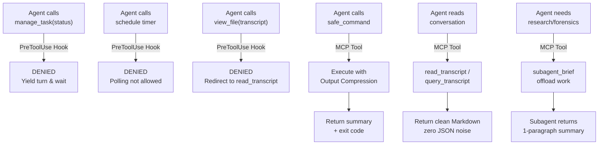

# Agy-Context-Saver 🛡️

**Cross-Platform Model Context Protocol (MCP) Server & Lifecycle Governor for Google Antigravity**

`Agy-Context-Saver` is a lightweight, zero-dependency MCP server and lifecycle governor purpose-built for **Google Antigravity** (`agy`). It eliminates session degradation, memory bloat, and chat stalls caused by **background task busy-wait polling** and **delayed context compaction**.

Because Google restricts third-party submissions to the Antigravity plugin marketplace, `Agy-Context-Saver` uses the **open Model Context Protocol (MCP)** standard so that any Antigravity user on macOS, Linux, or Windows can install and run it immediately via `mcp_config.json`.

---

## The Problem: Antigravity's Background Polling Trap

When an Antigravity agent runs a shell command that takes longer than `WaitMsBeforeAsync` (default ~5s), the platform detaches the process to a background task (`task-XYZ`). 

Without governance, models exhibit a compulsive **busy-waiting anti-pattern**:
1. The agent calls `manage_task(Action='status')` or schedules 30s timers with `schedule(...)` in an infinite loop.
2. Every `status` poll dumps the full task stdout buffer (hundreds of lines of raw ASCII progress dots and ANSI sequences) directly into the conversation transcript.
3. Because background context compaction fires infrequently, the transcript inflates by 50–100 KB per minute.
4. The context window degrades, prompt instructions get pushed out of attention, and the session crashes or becomes unresponsive.

---

## Architecture: 3-Layer Context Defense



### Layer 1: Intelligent Polling Governor & Reactive Wakeup
* **Blocks Runaway Busy-Waiting**: Blocks rapid repetitive `manage_task(Action='status')` polling loops and short artificial timers (<120s) that bloat transcripts.
* **Transcript Read Enforcement**: Intercepts naive `view_file` calls targeting `transcript.jsonl` or `transcript_full.jsonl`, denying them and redirecting the model to use `read_transcript` or `query_transcript`, permanently stopping post-compaction context bloat.
* **Safe Harbor for Stuck Task Debugging**: Allows status inspections for diagnostic troubleshooting if a process might not exit properly (deadlock, hung build). Initial check and spaced-out cooldown checks (>=30s) are permitted so agents can inspect logs and kill frozen processes.
* **Safe Harbor for `/teamwork-preview` & Subagents**: Multi-agent coordination and subagent tasks are never blocked from monitoring.
* **Watchdog Timers**: Legitimate watchdog timers on `schedule` (>= 120s) to catch unhandled stalls are fully permitted.
* **3-Tier Circuit Breaker**: If an agent model stubbornly attempts repeated denied polling calls in succession without yielding, the governor automatically escalates: Tier 1 (standard guidance) $\to$ Tier 2 (critical warning) $\to$ Tier 3 (`force_ask`), immediately freezing autonomous execution to prompt the user and halt runaway trajectory corruption.

### Layer 2: Fast Synchronous Execution & Output Compression
* **MCP `safe_command`**: Runs shell commands with generous timeouts and **intelligent output compression** (collapses repetitive test dots/logs into concise summaries), preventing raw log explosions from ever reaching the transcript.
* **Native Hook Overwrite**: Automatically forces `WaitMsBeforeAsync: 10000` on native Antigravity commands so fast commands (<10s) complete synchronously in the same turn without spawning background tasks.

### Layer 3: Subagent Context Offloading
* **MCP `subagent_brief`**: Generates scope-isolated prompts for delegated subagents (`invoke_subagent`).
* Subagents absorb heavy exploration (grepping, viewing multiple large files, inspecting raw transcripts) in their own sandboxed transcripts, returning only a high-signal briefing to the main thread.

---

---

## Zero-Delay Instant Installation ⚡

`Agy-Context-Saver` can be installed in milliseconds without manual configuration file editing:

### Option 1: One-Line CLI / NPX (Fastest)

```bash
# If using npx
npx agy-context-saver install

# Or locally inside the repository
npm run setup
```
*(Executes in ~15ms: automatically links the native Antigravity plugin and mirrors tool definitions).*

### Option 2: Native Antigravity Plugin Link (Zero Overhead)

Because `Agy-Context-Saver` is a fully structured Antigravity Plugin, you can link it directly into your Antigravity plugins directory:

**Windows (cmd / PowerShell):**
```powershell
.\install.ps1
# Or manual junction:
cmd /c mklink /J "$env:USERPROFILE\.gemini\config\plugins\agy-context-saver" "$PWD"
```

**macOS / Linux:**
```bash
./install.sh
# Or manual symlink:
ln -s "$(pwd)" ~/.gemini/config/plugins/agy-context-saver
```

### Option 3: Manual MCP Config (Optional)

If you prefer explicit MCP server registration in `~/.gemini/config/mcp_config.json`:

```json
{
  "mcpServers": {
    "agy-context-saver": {
      "command": "node",
      "args": ["C:/Users/USER/Desktop/Frameworks/Agy-Context-Saver/mcp/index.js"]
    }
  }
}
```

### Option 3: Universal MCP Server & Native In-Chat Tools

Once installed, 7 native MCP tools are directly available to your Antigravity agent or can be called from chat:

1. **`safe_command`**: Runs shell commands with intelligent log compression, streaming buffer concatenation, 2,000-char line clamping, and escalating SIGKILL timeout protection.
2. **`check_context_health`**: Streams `transcript.jsonl` using chunked `readline` to audit turn budgets, total payload sizes, and busy-polling events without memory spikes.
3. **`read_transcript`**: Reads recent conversation turns from Antigravity transcripts in clean Markdown with zero raw JSON noise. Supports `"compact"` and `"full"` modes with 1-to-2 parameters.
4. **`query_transcript`**: Forensic query and filtering engine. Searches by keyword or regex, filters by role (`user`, `assistant`, `tool`, `error`), and automatically dereferences truncated lines from `transcript_full.jsonl`.
5. **`subagent_brief`**: Formulates scope-isolated prompts for delegated subagents to offload context-heavy exploration.
6. **`get_installation_status`**: Audits the live 4-layer health (Plugin Link, Lifecycle Hook, MCP Server, Tool Schemas) from inside Antigravity or CLI.
7. **`sync_installation`**: Programmatically synchronizes and repairs the installation in ~25ms without terminal commands.

Check installation health from CLI at any time:
```bash
npm run status
# or
node mcp/index.js status
```

---

## Performance Optimizations & Resilience Engine

- **Streaming Transcript Engine**: Reads transcripts using `readline` chunk streams, processing 100,000+ steps with bounded memory.
- **Array Buffer Aggregation**: Replaces O(n²) string concatenation with `Buffer.concat()`, eliminating event loop latency on high-volume stdout.
- **Pathological Clamping**: Restricts single output lines to 2,000 characters and total output to 64 KB, preventing terminal stream lockups.
- **Process Tree Escalation**: Dispatches `SIGTERM`, followed by a 1.5s grace period before escalating to `SIGKILL` / Windows `taskkill /T /F` to eliminate zombie processes.
- **TTL State Cache & Atomic Writes**: Automatically evicts hook polling cache entries older than 1 hour, capping state memory and writing via atomic tempfiles.
- **3-Tier Circuit Breaker**: Repeated polling denials escalate from Tier 1 (guidance) $\to$ Tier 2 (critical warning) $\to$ Tier 3 (`force_ask`), immediately freezing autonomous execution to prompt the user and halt runaway trajectory corruption.

---

## Verification & Automated Tests

Run the complete test suite across all 4 layers:
```bash
npm test
```

Verification suite results:
```
Running Agy-Context-Saver intelligent hook tests...
✓ manage_task(status) initial check is allowed (safe harbor for debugging)
✓ manage_task(status) rapid consecutive poll is denied (busy-loop blocked)
✓ manage_task(status) with debugging context is allowed
✓ manage_task(status) with teamwork context is allowed
✓ manage_task(kill) is allowed
✓ run_command upgrades WaitMsBeforeAsync to 10000
✓ run_command with IsDaemon: true preserves wait window
✓ schedule short polling timer (<120s) is denied
✓ schedule watchdog timer (>=120s) is allowed
✓ schedule with teamwork context is allowed
✓ schedule standard timer is allowed
✓ state TTL eviction automatically purges entries older than 1 hour
✓ manage_task 3-tier circuit breaker correctly escalates Tier 1 -> Tier 2 -> Tier 3 (force_ask)
✓ schedule short polling timer escalates to force_ask on 5th denial
✓ manage_task(Action='list') initial call allowed, rapid consecutive polling blocked
All 15 intelligent hook tests passed successfully!

Running Agy-Context-Saver MCP Server tests...
✓ initialize handshake succeeded
✓ tools/list returned all 5 governance & installation tools
✓ tools/call (safe_command) executed and captured stdout
✓ tools/call (subagent_brief) generated scope-isolated brief
✓ tools/call (get_installation_status) reported live 4-layer health
✓ tools/call (sync_installation) verified dry-run synchronization
✓ resources/read served governance rulebook
✓ prompts/get served context_shield prompt
All MCP tests passed successfully!

Agy-Context-Saver Comprehensive End-to-End Probes
✓ Fail-open safety checks (empty stdin, non-JSON payloads, non-target tools) passed
✓ safe_command compressed 180 lines to 30 lines with status preservation
✓ safe_command non-zero exit status (exit 42) accurately retained
✓ check_context_health detected busy-polling loop and computed metrics
✓ subagent_brief generated scope-isolated instructions
✓ safe_command clamped pathological 5,000-char single line
✓ check_context_health tolerated corrupted JSON lines
✓ safe_command terminated long-running command on timeout with escalating signal protection
ALL END-TO-END VERIFICATION PROBES PASSED 100%!

Agy-Context-Saver Live Installed System Validation
✓ hooks.json contains execution-guard and preserved waymark-continuity
✓ mcp_config.json contains agy-context-saver and preserved waymark-engine
✓ All 5 Antigravity tool schemas successfully installed to ~/.gemini/antigravity/mcp/agy-context-saver
✓ detectExistingInstallation() accurately verifies all 4 installation layers
✓ Live Hook Execution Verification passed across all safe harbors and upgrades
✓ Live Installed MCP Server Protocol Verification passed across all tools, resources, and prompts
ALL LIVE INSTALLED SYSTEM VALIDATIONS PASSED 100%!
```

---

## License
MIT License. Created by paragon-ux.
