# Agy-Context-Saver 🛡️

**Cross-Platform Model Context Protocol (MCP) Server & Lifecycle Governor for Google Antigravity**

`Agy-Context-Saver` is a lightweight, zero-dependency MCP server and lifecycle governor purpose-built for **Google Antigravity** (`agy`). It eliminates session degradation, memory bloat, and chat stalls caused by **background task busy-wait polling** and **delayed context compaction**.

Because Google restricts third-party submissions to the Antigravity plugin marketplace, `Agy-Context-Saver` uses the **open Model Context Protocol (MCP)** standard so that any Antigravity user on macOS, Linux, or Windows can install and run it immediately via `mcp_config.json`.

---

## The Problem: Antigravity's Background Polling Trap

When an Antigravity agent runs a shell command that takes longer than `WaitMsBeforeAsync` (default ~5s), the platform detaches the process to a background task (`task-XYZ`). 

Without governance, models exhibit a compulsive **busy-waiting anti-pattern**:
1. The agent calls `manage_task(Action='status')` or schedules 30s timers with `schedule(...)` in an infinite loop.
2. Every `status` poll dumps the full task stdout buffer (hundreds of lines of raw ASCII progress dots and ANSI sequences) directly into the conversation transcript.
3. Because background context compaction fires infrequently, the transcript inflates by 50–100 KB per minute.
4. The context window degrades, prompt instructions get pushed out of attention, and the session crashes or becomes unresponsive.

---

## Architecture: 3-Layer Context Defense

```mermaid
flowchart TD
    subgraph Layer 1: Machine-Enforced Polling Ban
        A["Agent calls manage_task('status')"] --> B["PreToolUse Hook intercepts"]
        B -->|Status Poll Detected| C["Return decision: 'deny'<br/>'Polling denied. Yield turn and wait for Reactive Wakeup.'"]
        
        D["Agent calls schedule(polling timer)"] --> E["PreToolUse Hook intercepts"]
        E -->|Polling Intent Detected| F["Return decision: 'deny'<br/>'Artificial polling timer denied.'"]
    end

    subgraph Layer 2: Fast Synchronous Execution & Safe Execution
        G["Agent calls safe_command (MCP)"] --> H["Execute with Smart Output Compression"]
        H --> I["Return clean summary + exit code (Zero Bloat)"]
        
        J["Agent calls run_command (Native)"] --> K["PreToolUse Hook forces WaitMsBeforeAsync = 10000"]
    end

    subgraph Layer 3: Context Offloading via Subagents
        L["Agent needs broad research / deep forensics"] --> M["Call subagent_brief (MCP)"]
        M --> N["Launch Subagent in isolated sandbox"]
        N --> O["Returns concise 1-paragraph summary to Main Thread"]
    end
```



### Layer 1: Hard Polling Denial & Reactive Wakeup
* **Blocks Recursive Polling**: Denies `manage_task(Action='status')` calls and artificial `schedule` timers.
* **Enforces Reactive Wakeup**: Forces the agent to stop calling tools and yield the turn. When the background task exits, Antigravity's native `<SYSTEM_MESSAGE>` completion notification automatically wakes up the agent.

### Layer 2: Fast Synchronous Execution & Output Compression
* **MCP `safe_command`**: Runs shell commands with generous timeouts and **intelligent output compression** (collapses repetitive test dots/logs into concise summaries), preventing raw log explosions from ever reaching the transcript.
* **Native Hook Overwrite**: Automatically forces `WaitMsBeforeAsync: 10000` on native Antigravity commands so fast commands (<10s) complete synchronously in the same turn without spawning background tasks.

### Layer 3: Subagent Context Offloading
* **MCP `subagent_brief`**: Generates scope-isolated prompts for delegated subagents (`invoke_subagent`).
* Subagents absorb heavy exploration (grepping, viewing multiple large files, inspecting raw transcripts) in their own sandboxed transcripts, returning only a high-signal briefing to the main thread.

---

## Universal MCP Server Setup

Add `agy-context-saver` to your Antigravity MCP configuration file (`~/.gemini/config/mcp_config.json`):

```json
{
  "mcpServers": {
    "agy-context-saver": {
      "command": "node",
      "args": ["C:/Users/USER/Desktop/Frameworks/Agy-Context-Saver/mcp/index.js"]
    }
  }
}
```

*(Or via `npx` once published to npm: `"command": "npx", "args": ["-y", "agy-context-saver"]` across macOS, Linux, and Windows.)*

---

## MCP Features Exposed

### Tools
| Tool | Description |
| :--- | :--- |
| `safe_command` | Executes commands with generous timeouts and output compression (collapses test dot streams). |
| `check_context_health` | Analyzes `transcript.jsonl` to report turn count, raw payload size, and active polling loops. |
| `subagent_brief` | Generates scope-isolated prompts for subagents to offload context-gathering. |

### Prompts
| Prompt | Description |
| :--- | :--- |
| `context_shield` | One-click prompt that injects the complete 3-Layer Context Governance rulebook. |

### Resources
| URI | Description |
| :--- | :--- |
| `context-saver://rules/governance` | Read-only markdown resource containing the authoritative governance rules. |

---

## Local Antigravity Lifecycle Hook (Optional Pre-Tool Guard)

For users who also want **machine-level physical denial** of native `manage_task(status)` before tool execution:

Run the included installer:
```powershell
.\install.ps1
```
Or register the hook directly in `~/.gemini/config/hooks.json`:
```json
{
  "execution-guard": {
    "PreToolUse": [
      {
        "matcher": "manage_task|run_command|schedule",
        "hooks": [
          {
            "type": "command",
            "command": "node scripts/execution-guard-hook.mjs",
            "timeout": 5
          }
        ]
      }
    ]
  }
}
```

---

## Verification & Automated Tests

Run the test suite (verifies both the native lifecycle hook and the MCP server):
```bash
npm test
```

Test output:
```
Running Agy-Context-Saver hook tests...

✓ manage_task(status) is denied
✓ manage_task(kill) is allowed
✓ run_command upgrades WaitMsBeforeAsync to 10000
✓ run_command with IsDaemon: true preserves wait window
✓ schedule with task polling prompt is denied
✓ schedule standard timer is allowed

Running Agy-Context-Saver MCP Server tests...

✓ initialize handshake succeeded
✓ tools/list returned all 3 governance tools
✓ tools/call (safe_command) executed and captured stdout
✓ tools/call (subagent_brief) generated scope-isolated brief
✓ resources/read served governance rulebook
✓ prompts/get served context_shield prompt

All tests passed successfully!
```

---

## License
MIT License. Created by paragon-ux.
