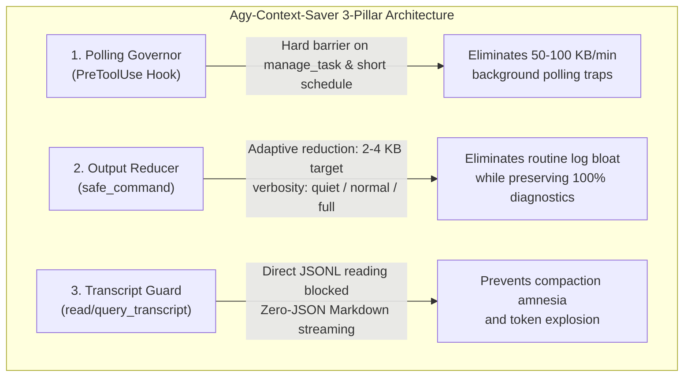

# Agy-Context-Saver 🛡️

**Model Context Protocol (MCP) Server & Lifecycle Governor for Google Antigravity**

[](https://www.npmjs.com/package/agy-context-saver)
[](LICENSE)
[](https://paragon-ux.github.io/agy-context-saver/)
[](https://github.com/paragon-ux/agy-context-saver/actions)

`Agy-Context-Saver` is a lightweight, zero-dependency MCP server and lifecycle governor purpose-built for **Google Antigravity** (`agy`). It permanently eliminates session degradation, memory bloat, and context window exhaustion caused by **background task busy-wait polling** and **raw JSON transcript reading**.

---

## The Core Problems Solved

1. **The Polling Trap**: When shell tasks detach to background jobs (`task-XYZ`), models waste tokens by repeatedly calling `manage_task(Action='status')` or short timers. This pollutes transcripts with hundreds of raw ASCII progress dots and ANSI escape sequences.
2. **The Raw Transcript Trap**: Naive `view_file` reads on multi-megabyte `transcript.jsonl` files flood the working memory with raw JSON syntax, bracket overhead, and truncated line references, triggering rapid context compaction amnesia.

---

## 3-Pillar Architecture Overview



---

## Quickstart (Instant Install)

Install and activate the governor across your Antigravity environment in milliseconds:

```bash
# Fastest: one-line registration via npx
npx agy-context-saver install

# Or locally from this repository
npm run setup

# Audit health at any time
npm run status
```

---

## Key Capabilities

- **Adaptive Semantic Output Reducer**: Collapses repetitive test passes (`PASS ...`, `✓ ...`), progress indicators, and consecutive identical lines into compact explicit badges, targeting **2–4 KB** on routine commands while preserving 100% of errors, stack traces, `stderr`, and diffs.
- **Three Verbosity Tiers (`quiet`, `normal`, `full`)**:
  - `quiet`: Ultra-compact 1-line badge ($\le 200$ chars) on success; automatically bypasses to full diagnostics on failure. (Supports legacy `terse: true`).
  - `normal` (default): Adaptive semantic reduction with Markdown code fencing for optimal token economics and UI scannability.
  - `full`: Uncompressed raw output bounded by the 24 KB safety ceiling for forensic debugging.
- **Clean Markdown Code Fencing**: Wraps multi-line terminal outputs in ```` ```text ```` code fences so monospace indentation, line breaks, and table columns render properly in Antigravity's IDE timeline.
- **Hard 24 KB Ceiling & Line Clamping**: Strictly prevents the Antigravity host process from spilling tool returns onto disk as `.system_generated/steps/...` files.
- **Dynamic Workspace Cwd Detection**: Resolves active project directories automatically from Antigravity's local SQLite database.
- **Zero-JSON Transcript Streaming**: Stream conversation turns without raw JSON syntax using `read_transcript` and `query_transcript`.
- **Zero External Dependencies**: 100% native Node.js standard library. Zero npm supply-chain risk.

---

## Comprehensive Documentation

For complete technical specifications, architectural diagrams, parameter references, and lifecycle hook internals, visit our **[Zensical Documentation Site](https://paragon-ux.github.io/agy-context-saver/)**:

- 📖 **[Installation & Setup](docs/installation.md)**: NPX, native plugin symlinking, manual configuration, and clean uninstallation.
- 🛠️ **[MCP Tool Reference](docs/tools.md)**: Full parameter tables, return contracts, and examples for all 7 tools.
- 🛡️ **[Lifecycle Governance](docs/governance.md)**: `PreToolUse` hook mechanics, 3-tier circuit breaker, and fail-open guarantees.
- 🏗️ **[Architecture & Internals](docs/architecture.md)**: 3-layer defense model, buffer aggregation, and SQLite workspace resolution.
- 📦 **[Publishing & Verification](docs/publishing.md)**: Packaging whitelist, pre-flight audits, and release instructions.

---

## Local Documentation Server

Build or serve the documentation locally using **Zensical**:

```bash
# Build static site
py -3.11 -m zensical build

# Serve live preview
py -3.11 -m zensical serve
```

---

## License

MIT License. Copyright (c) 2026 paragon-ux.
