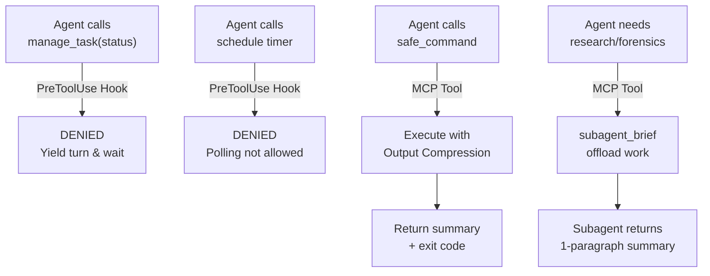

# Agy-Context-Saver 🛡️

**Cross-Platform Model Context Protocol (MCP) Server & Lifecycle Governor for Google Antigravity**

`Agy-Context-Saver` is a lightweight, zero-dependency MCP server and lifecycle governor purpose-built for **Google Antigravity** (`agy`). It eliminates session degradation, memory bloat, and chat stalls caused by **background task busy-wait polling** and **delayed context compaction**.

Because Google restricts third-party submissions to the Antigravity plugin marketplace, `Agy-Context-Saver` uses the **open Model Context Protocol (MCP)** standard so that any Antigravity user on macOS, Linux, or Windows can install and run it immediately via `mcp_config.json`.

---

## The Problem: Antigravity's Background Polling Trap

When an Antigravity agent runs a shell command that takes longer than `WaitMsBeforeAsync` (default ~5s), the platform detaches the process to a background task (`task-XYZ`). 

Without governance, models exhibit a compulsive **busy-waiting anti-pattern**:
1. The agent calls `manage_task(Action='status')` or schedules 30s timers with `schedule(...)` in an infinite loop.
2. Every `status` poll dumps the full task stdout buffer (hundreds of lines of raw ASCII progress dots and ANSI sequences) directly into the conversation transcript.
3. Because background context compaction fires infrequently, the transcript inflates by 50–100 KB per minute.
4. The context window degrades, prompt instructions get pushed out of attention, and the session crashes or becomes unresponsive.

---

## Architecture: 3-Layer Context Defense



### Layer 1: Intelligent Polling Governor & Reactive Wakeup
* **Blocks Runaway Busy-Waiting**: Blocks rapid repetitive `manage_task(Action='status')` polling loops and short artificial timers (<120s) that bloat transcripts.
* **Safe Harbor for Stuck Task Debugging**: Allows status inspections for diagnostic troubleshooting if a process might not exit properly (deadlock, hung build). Initial check and spaced-out cooldown checks (>=30s) are permitted so agents can inspect logs and kill frozen processes.
* **Safe Harbor for `/teamwork-preview` & Subagents**: Multi-agent coordination and subagent tasks are never blocked from monitoring.
* **Watchdog Timers**: Legitimate watchdog timers on `schedule` (>= 120s) to catch unhandled stalls are fully permitted.

### Layer 2: Fast Synchronous Execution & Output Compression
* **MCP `safe_command`**: Runs shell commands with generous timeouts and **intelligent output compression** (collapses repetitive test dots/logs into concise summaries), preventing raw log explosions from ever reaching the transcript.
* **Native Hook Overwrite**: Automatically forces `WaitMsBeforeAsync: 10000` on native Antigravity commands so fast commands (<10s) complete synchronously in the same turn without spawning background tasks.

### Layer 3: Subagent Context Offloading
* **MCP `subagent_brief`**: Generates scope-isolated prompts for delegated subagents (`invoke_subagent`).
* Subagents absorb heavy exploration (grepping, viewing multiple large files, inspecting raw transcripts) in their own sandboxed transcripts, returning only a high-signal briefing to the main thread.

---

---

## Zero-Delay Instant Installation ⚡

`Agy-Context-Saver` can be installed in milliseconds without manual configuration file editing:

### Option 1: One-Line CLI / NPX (Fastest)

```bash
# If using npx
npx agy-context-saver install

# Or locally inside the repository
npm run setup
```
*(Executes in ~15ms: automatically links the native Antigravity plugin and mirrors tool definitions).*

### Option 2: Native Antigravity Plugin Link (Zero Overhead)

Because `Agy-Context-Saver` is a fully structured Antigravity Plugin, you can link it directly into your Antigravity plugins directory:

**Windows (cmd / PowerShell):**
```powershell
.\install.ps1
# Or manual junction:
cmd /c mklink /J "$env:USERPROFILE\.gemini\config\plugins\agy-context-saver" "$PWD"
```

**macOS / Linux:**
```bash
./install.sh
# Or manual symlink:
ln -s "$(pwd)" ~/.gemini/config/plugins/agy-context-saver
```

### Option 3: Manual MCP Config (Optional)

If you prefer explicit MCP server registration in `~/.gemini/config/mcp_config.json`:

```json
{
  "mcpServers": {
    "agy-context-saver": {
      "command": "node",
      "args": ["C:/Users/USER/Desktop/Frameworks/Agy-Context-Saver/mcp/index.js"]
    }
  }
}
```

Check installation health at any time:
```bash
npm run status
# or
node mcp/index.js status
```

---

## Verification & Automated Tests

Run the test suite (verifies both the native lifecycle hook and the MCP server):
```bash
npm test
```

Test output:
```
Running Agy-Context-Saver hook tests...

✓ manage_task(status) is denied
✓ manage_task(kill) is allowed
✓ run_command upgrades WaitMsBeforeAsync to 10000
✓ run_command with IsDaemon: true preserves wait window
✓ schedule with task polling prompt is denied
✓ schedule standard timer is allowed

Running Agy-Context-Saver MCP Server tests...

✓ initialize handshake succeeded
✓ tools/list returned all 3 governance tools
✓ tools/call (safe_command) executed and captured stdout
✓ tools/call (subagent_brief) generated scope-isolated brief
✓ resources/read served governance rulebook
✓ prompts/get served context_shield prompt

All tests passed successfully!
```

---

## License
MIT License. Created by paragon-ux.
