# Agy-Context-Saver 🛡️

**Cross-Platform Model Context Protocol (MCP) Server & Lifecycle Governor for AI Coding Agents**

`Agy-Context-Saver` is a lightweight, zero-dependency MCP server and lifecycle governor designed for **Google Antigravity**, **Claude Code**, **Cursor**, and **OpenAI Codex**. It prevents context window bloat, transcript degradation, and session stalls caused by **background task busy-wait polling** and **delayed context compaction**.

Because Google restricts third-party submissions to the Antigravity plugin marketplace, `Agy-Context-Saver` is distributed as a **universal MCP server** that works anywhere on macOS, Linux, and Windows.

---

## The Problem: The Antigravity Polling Trap

When an agent runs a command that takes longer than `WaitMsBeforeAsync` (default ~5s), the platform detaches the process to a background task. 

Without governance, LLMs exhibit a compulsive **busy-waiting anti-pattern**:
1. The agent calls `manage_task(Action='status')` or schedules 30s timers with `schedule(...)` in an infinite loop.
2. Every `status` poll dumps hundreds of lines of raw ASCII progress dots into the conversation transcript.
3. Because context compaction fires infrequently, the transcript inflates by 50–100 KB per minute.
4. The context window degrades, prompt instructions get pushed out of attention, and the session crashes or stalls.

---

## Architecture: 3-Layer Context Defense

```mermaid
flowchart TD
    subgraph Layer 1: Machine-Enforced Polling Ban
        A["Agent calls manage_task('status')"] --> B["PreToolUse Hook intercepts"]
        B -->|Status Poll Detected| C["Return decision: 'deny'<br/>'Polling denied. Yield turn and wait for Reactive Wakeup.'"]
        
        D["Agent calls schedule(polling timer)"] --> E["PreToolUse Hook intercepts"]
        E -->|Polling Intent Detected| F["Return decision: 'deny'<br/>'Artificial polling timer denied.'"]
    end

    subgraph Layer 2: Fast Synchronous Execution & Safe Execution
        G["Agent calls safe_command (MCP)"] --> H["Execute with Smart Output Compression"]
        H --> I["Return clean summary + exit code (Zero Bloat)"]
        
        J["Agent calls run_command (Native)"] --> K["PreToolUse Hook forces WaitMsBeforeAsync = 10000"]
    end

    subgraph Layer 3: Context Offloading via Subagents
        L["Agent needs broad research / deep forensics"] --> M["Call subagent_brief (MCP)"]
        M --> N["Launch Subagent in isolated sandbox"]
        N --> O["Returns concise 1-paragraph summary to Main Thread"]
    end
```



### Layer 1: Polling Denial & Reactive Wakeup
* Blocks recursive `manage_task(status)` polling and artificial `schedule` timers.
* Enforces Antigravity's native **Reactive Wakeup** (`<SYSTEM_MESSAGE>`). The agent yields the turn, and the host wakes it up automatically upon command completion.

### Layer 2: Fast Synchronous Execution & Output Compression
* **MCP `safe_command`**: Runs shell commands with generous timeouts and **intelligent output compression** (collapses 10,000 lines of repetitive test dots into a 3-line summary), keeping the context pristine.
* **Native Hook Overwrite**: Automatically upgrades `WaitMsBeforeAsync: 10000` on native Antigravity commands so fast commands (<10s) complete synchronously in-turn.

### Layer 3: Subagent Context Offloading
* **MCP `subagent_brief`**: Formulates scope-isolated prompts for delegated subagents (`invoke_subagent`).
* Subagents absorb heavy exploration (grepping, viewing 20 files, log forensics) in their own sandboxed transcripts, returning only a high-signal briefing to the main thread.

---

## Universal MCP Server Setup (Cross-Platform)

Add `agy-context-saver` to your configuration file on macOS, Linux, or Windows:

### 1. Google Antigravity (`~/.gemini/config/mcp_config.json`)
```json
{
  "mcpServers": {
    "agy-context-saver": {
      "command": "node",
      "args": ["C:/Users/USER/Desktop/Frameworks/Agy-Context-Saver/mcp/index.js"]
    }
  }
}
```
*(Or via `npx` once published to npm: `"command": "npx", "args": ["-y", "agy-context-saver"]`)*

### 2. Cursor (`.cursor/mcp.json`)
```json
{
  "mcpServers": {
    "agy-context-saver": {
      "command": "node",
      "args": ["/path/to/Agy-Context-Saver/mcp/index.js"]
    }
  }
}
```

### 3. Claude Code (`~/.claude/mcp.json`)
```json
{
  "mcpServers": {
    "agy-context-saver": {
      "command": "node",
      "args": ["/path/to/Agy-Context-Saver/mcp/index.js"]
    }
  }
}
```

---

## MCP Features Exposed

### Tools
| Tool | Description |
| :--- | :--- |
| `safe_command` | Executes commands with generous timeouts and output compression (prevents transcript bloat). |
| `check_context_health` | Analyzes `transcript.jsonl` to report turn count, transcript size, and active polling loops. |
| `subagent_brief` | Generates scope-isolated prompts for subagents to offload context-gathering. |

### Prompts
| Prompt | Description |
| :--- | :--- |
| `context_shield` | One-click prompt that injects the complete 3-Layer Context Governance rulebook. |

### Resources
| URI | Description |
| :--- | :--- |
| `context-saver://rules/governance` | Read-only markdown resource containing the authoritative governance rules. |

---

## Local Antigravity Lifecycle Hook (Optional Pre-Tool Guard)

For Antigravity users who want **machine-level physical denial** of `manage_task(status)` before tool execution:

Run the included installer:
```powershell
.\install.ps1
```
Or register the hook in `~/.gemini/config/hooks.json`:
```json
{
  "execution-guard": {
    "PreToolUse": [
      {
        "matcher": "manage_task|run_command|schedule",
        "hooks": [
          {
            "type": "command",
            "command": "node scripts/execution-guard-hook.mjs",
            "timeout": 5
          }
        ]
      }
    ]
  }
}
```

---

## Verification & Automated Tests

Run the test suite (verifies both the native lifecycle hook and the MCP server):
```bash
npm test
```

Test output:
```
Running Agy-Context-Saver hook tests...

✓ manage_task(status) is denied
✓ manage_task(kill) is allowed
✓ run_command upgrades WaitMsBeforeAsync to 10000
✓ run_command with IsDaemon: true preserves wait window
✓ schedule with task polling prompt is denied
✓ schedule standard timer is allowed

Running Agy-Context-Saver MCP Server tests...

✓ initialize handshake succeeded
✓ tools/list returned all 3 governance tools
✓ tools/call (safe_command) executed and captured stdout
✓ tools/call (subagent_brief) generated scope-isolated brief
✓ resources/read served governance rulebook
✓ prompts/get served context_shield prompt

All tests passed successfully!
```

---

## License
MIT License. Created by paragon-ux.
