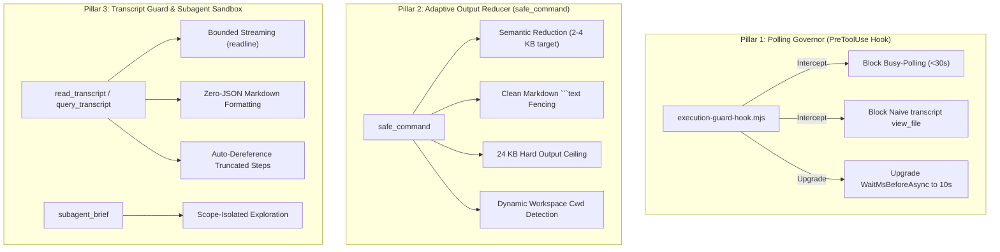

# Architecture & Internals

`Agy-Context-Saver` is designed to be lightweight, zero-dependency, and high-performance.

---

## 3-Pillar Context Architecture



---

## Key Technical Subsystems

### 1. Adaptive Semantic Output Reduction
`safe_command` implements a multi-stage classification and reduction pipeline:
- **Phase A (Diagnostic Protection)**: Scans for non-zero exit codes, compiler diagnostics, stack traces, and `stderr`. These lines are prioritized and never dropped.
- **Phase B (Semantic Repetition Collapse)**: Detects runs of consecutive test passes (`PASS ...`, `✓ ...`), progress indicators (`....`), and consecutive identical lines, collapsing them into concise count markers (e.g. `... [42 repetitive test pass lines collapsed] ...`).
- **Phase C (Target Budget Optimization)**: Normal execution targets 2–4 KB, preventing routine logs from degrading LLM attention while preserving 100% of information needed for downstream reasoning.
- **Phase D (Presentation Fencing)**: Wraps multi-line output in Markdown ` ```text ` code fences to preserve column alignment and monospace formatting in Antigravity's IDE renderer.

### 1. Dynamic Workspace Auto-Resolution
When an agent or tool invokes `safe_command` without an explicit `cwd` argument, the server does not fall back to its own daemon path (`~/.gemini/config/plugins/...`). 

Instead, it dynamically queries Antigravity's local SQLite database:
```javascript
// mcp/index.js
const dbPath = path.join(antigravityDir, 'conversation_summaries.db');
// Queries the active conversation record to extract the primary workspace URI
```
This ensures build tools, linters, and git commands always execute in the user's active codebase directory.

### 2. The 24 KB Ceiling (Disk Spillover Prevention)
The Antigravity host process monitors MCP tool returns. If a tool result exceeds ~28–30 KB, Antigravity intercepts the text and writes it to disk:
```text
.system_generated/steps/<step>/output.txt
```
This disk redirection forces the agent model into extra reading steps and corrupts clean conversation formatting. 

`Agy-Context-Saver` implements a strict **24,000-character ceiling** (`MAX_TOTAL_CHARS = 24000`) and **1,000-character line clamp** on tool returns. Pathological compiler outputs are cleanly summarized in-stream, guaranteeing that outputs are never redirected to disk.

### 3. High-Performance Buffer Aggregation
Instead of naive string concatenation (`output += chunk`), which incurs severe $O(n^2)$ memory reallocation on multi-megabyte streams, `Agy-Context-Saver` buffers stdout and stderr chunks in memory arrays and executes single-pass `Buffer.concat()` aggregation on completion.

### 4. Process Tree Termination
When a command times out:
1. Dispatches `SIGTERM` (POSIX) or polite signal.
2. Waits 1.5 seconds for clean exit.
3. If still alive, issues escalating `SIGKILL` or Windows `taskkill /T /F /PID <pid>` to terminate child compiler subtrees and background threads without lingering zombie processes.
