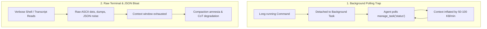

# Overview & Motivation

**Agy-Context-Saver** is an open-source Model Context Protocol (MCP) server and lifecycle governor engineered specifically for **Google Antigravity** (`agy`), paired with **RTK (Rust Token Killer)** for transparent CLI output reduction.

It eliminates session degradation, memory leaks, and context window exhaustion caused by **background task busy-wait polling**, **terminal output bloat**, **native inspection bypasses**, and **raw transcript reading**.

---

## Why Agy-Context-Saver + RTK?

`Agy-Context-Saver` leverages the **open Model Context Protocol (MCP)** specification alongside native Antigravity lifecycle hooks, integrating seamlessly with RTK:

- **RTK owns command optimization**: Supported shell commands are transparently rewritten via `rtk rewrite` before execution, yielding 60–90% token reduction across git, pytest, cargo, npm, docker, and linters.
- **Agy owns Antigravity integrity**: Hard-routes native inspection tools to canonical RTK shell commands, enforces Reactive Wakeup, blocks direct access to internal `.system_generated` state, and provides zero-JSON Markdown transcript extraction.

Any developer running Antigravity on macOS, Linux, or Windows can install and activate the governor immediately without external cloud dependencies.

---

## The Core Problems Solved

### 1. The Background Task Polling Trap
When an agent initiates a shell command exceeding `WaitMsBeforeAsync` (~5 seconds), Antigravity detaches the process into a background task (`task-XYZ`).
- **The Anti-Pattern**: Large Language Models exhibit an innate busy-waiting bias: they repeatedly invoke `manage_task(Action='status')` or schedule short timers rather than yielding execution to the native **Reactive Wakeup** system.
- **The Consequence**: Transcripts bloat rapidly, pushing critical user instructions and architectural constraints out of the attention window, degrading model reasoning and causing session stalls.
- **The Solution**: Agy's closed session ledger blocks repeated polling and enforces native Reactive Wakeup (`<SYSTEM_MESSAGE>`).

### 2. The Terminal Output Bloat Trap
- **The Problem**: Routine test runs, linters, and build commands dump thousands of repetitive pass lines and progress indicators into the transcript.
- **The Solution**: RTK transparently intercepts and optimizes commands via PreToolUse hooks, collapsing passes and preserving failures.

### 3. The Native Inspection Bypass Trap
- **The Problem**: Native file and search tools (`view_file`, `grep_search`, `find_by_name`, `list_dir`) bypass RTK command optimization.
- **The Solution**: Agy hard-routes workspace inspection to canonical RTK CLI interfaces (`rtk read`, `rtk grep`, `rtk find`, `rtk ls`).

### 4. The Raw Transcript Reading Trap
- **The Problem**: Direct `view_file` on `.system_generated/logs/transcript.jsonl` floods working memory with raw JSON syntax.
- **The Solution**: Agy blocks direct reads of `.system_generated` by root and provides streaming Markdown tools (`read_transcript`, `query_transcript`).

---

## Core Value Proposition

| Metric / Feature | Without Governor | With Agy-Context-Saver + RTK |
| :--- | :--- | :--- |
| **Command Output Bloat** | Unlimited raw test dots, ANSI dumps | RTK transparent reduction (60–90% token savings) |
| **Workspace File Inspection** | Massive uncompressed view_file dumps | Compact `rtk read`, `rtk grep`, `rtk find` |
| **Long Command Execution** | Detached after 5s $\to$ busy-wait loop | Synchronous window expanded to 10s $\to$ finishes in-turn |
| **Background Task Monitoring** | Repetitive busy-polling loops | Enforced Reactive Wakeup with 5-strike circuit breaker |
| **Transcript Review** | Raw JSONL dumped into context | Clean human-readable Markdown via `read_transcript` |
| **Runtime Dependencies** | N/A | **Zero** external npm dependencies (100% Node.js stdlib) + native RTK binary |
